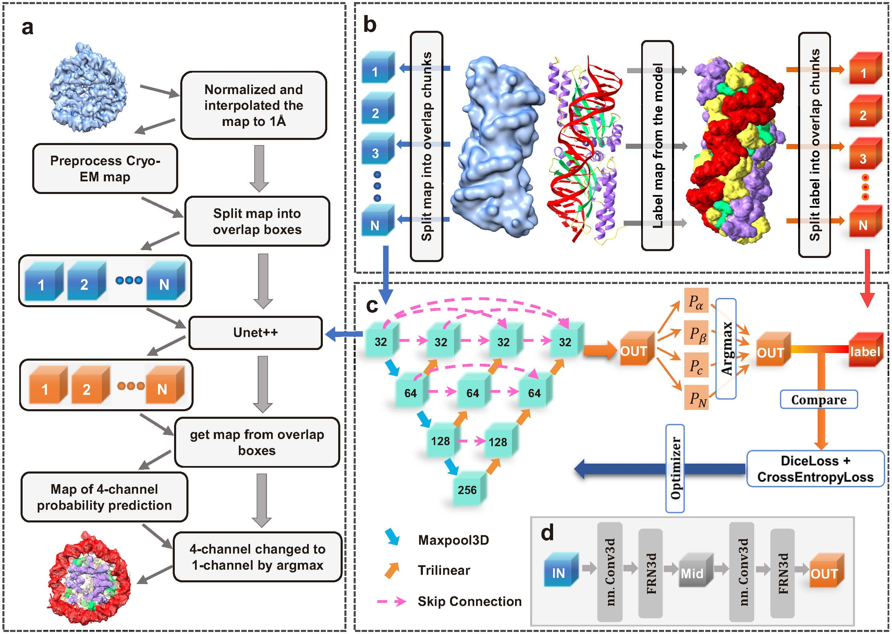

# EMInfo

## Deciphering the structural information of proteins and nucleic acids in cryo-EM maps using deep learning.

**Copyright (C) 2023 Hong Cao, Jiahua He, Tao Li, Hao Li, Sheng-You Huang and Huazhong University of Science and Technology**

If you have any questions regarding this program, please don't hesitate to contact us via [huangsy@hust.edu.cn](mailto:huangsy@hust.edu.cn)

 

$\color {red} {Note:}$ Citation of the following references should be included in any publication that uses the data or results generated by EMInfo:

> Hong Cao, Jiahua He, Tao Li and Sheng-You Huang, Deciphering the structural information of proteins and nucleic acids in cryo-EM maps using deep learning 2023, submitted.

---

## List of contents
| **File name** | **Description** |
| :---- | :---- |
| **EMInfo.sh** | The main program wrapped in a shell script to run EMInfo |
| **environment.yml** | Required packages for Python virtual environment of EMInfo |
| **interp3d.f90** | Fortran source code for the interpolation of EM grid |
| **eminfo.py** | Python script of EMInfo |
| **model.py** | Pytorch implementation of 3D UNet++ |
| **utils.py** | Python utilities |
 

## Install EMInfo

### 1. Installation of required online python packages using conda

     conda env create -f environment.yml

This command will create a [Python](https://www.python.org) (ver. 3.9.12) virtual environment named "**eminfo_env**" 
and install all the required packages automatically using [conda](https://conda.org/), e.g., 
[Anaconda](https://www.anaconda.com/), [Miniconda](https://docs.anaconda.com/miniconda/), [Miniforge](https://github.com/conda-forge/miniforge) (recommended), etc.

#### Detailed requirements of python packages

| *Package name* | *Recommended version* |
| :---- | :---- |
| [pytorch](https://pytorch.org) | 2.0.0 |
| [pytorch-cuda](https://pytorch.org) | 11.7 |
| [biopython](https://biopython.org/) | 1.79 |
| [joblib](https://pypi.org/project/joblib) | 1.2.0 |
| [mrcfile](https://github.com/ccpem/mrcfile) | 1.3.0 |
| [numpy](https://www.numpy.org) | 1.24.2 |
| [scikit-learn](https://scikit-learn.org/) | 1.1.1 |
| [scipy](https://scipy.org/) | 1.10.1 |
| [threadpoolctl](https://pypi.org/project/threadpoolctl/) | 3.1.0 |
 

### 2. Build the interpolation program "interp3d.f90" as a python package using f2py

:exclamation:The version of $\rm \color{magenta} f2py$ should match the version of Python in EMInfo2's conda environment:

     conda activate eminfo_env
 

     f2py -c ./interp3d.f90 -m interp3d

This command will generate an ELF file with name like "**interp3d.cpython-\*.so**". Please keep "**interp3d.cpython-\*.so**" with all python scripts in the same directory (the root directory of EMReady2).

Fortran compiler (e.g.， [gfortran](https://gcc.gnu.org/fortran/), [ifort](https://www.intel.com/content/www/us/en/developer/tools/oneapi/fortran-compiler.html), etc) is required to run $\rm \color{magenta} f2py$. For Linux systems with Debian package management (e.g., Debian, Ubuntu), **gfortran** can be easily installed via:

     sudo apt-get install gfortran

Alternatively, users can also install **gfortran** via conda (in the same conda environment of EMInfo):

     conda install -c conda-forge gfortran==11.4

If the fortran compiler is not in PATH, users can manually specify the path of their fortran compiler, for example:

     f2py -c ./interp3d.f90 -m interp3d --fcompiler=gnu95 --f77exec=/path/to/gfortran --f90exec=/path/to/gfortran

For more information about $\rm \color{magenta} f2py$, please refer to the [official documentation](https://numpy.org/doc/stable/f2py/).

 

### 3. Set user-specific variables in "EMInfo.sh"

**a**. Set "**EMInfo_home**" to the root directory of EMInfo. For example, if EMInfo is unzipped to "/home/hcao/EMInfo", set:

     EMInfo_home="/home/hcao/EMInfo"

**b**. Set "**activate**" to path of conda activate script. For example, if [anaconda](https://www.anaconda.com/) is located at "/home/hcao/anaconda3/", set:

     activate="/home/hcao/anaconda3/bin/activate"

**c**. Set "**EMInfo_env**" to name of the conda environment that have all the required packages installed. 
By default, the conda environment for EMInfo is named as "eminfo_env", so we set:

     EMInfo_env="eminfo_env"
 

---

## Run EMInfo
### Usage:

     ./EMInfo.sh in_map.mrc contour [Options]

#### Required arguments:

     in_map.mrc:    File name of the input EM density map in MRC2014 format.

     contour:   The contour level of input EM density map file.

### Options:

| *Option* | *Description* | *Default* |
| :---- | :---- | :---- |
| -f | Select which fold of the EXP model to use. | None |
| -g | ID(s) of GPU devices to be used, e.g., *0* for GPU #0, and *2,3,6* for GPUs #2, #3, and #6 | 0 |
| -s | The stride of the sliding window to cut the input map into overlapping boxes | 12 |
| -b | Number of input boxes in one batch | 16 |
| -p | Input the path of pdb file for evaluate | None |
| --evaluate | Evaluate the F1-score and Q4-accuracy of annotated map | - |
| --use_cpu | Run EMReady2 on CPU instead of GPU | - |

### Notes:

1. Users can adjust the stride of the sliding window by option $\rm \color{orange} \text{-}s$ to control the number of overlapping boxes to be calculated.
The larger the stride is, the fewer the overlapping boxes need to be calculated, and vice versa
The size of the overlapping boxes is fixed to 48×48×48, so the maximum value of stride is 48.
However, the stride should not be too large, otherwise some inconsistencies among sliding boxes will be introduced to the processed map.
In most cases, the default value (12) is recommended. For larger density maps, a stride value of 24 is a decent choice.

2. By default, EMInfo will run on GPU(s). Users can adjust the batch size according to the available VRAM of their GPU by option $\rm \color{orange} \text{-}b$.
Empirically, an NVIDIA A100 with 40 GB VRAM can afford a batch size of about 200. 
Users can also run EMInfo on the cpu using option $\rm \color{orange} \text{--}use\underline{ }cpu$.
But this may take extremely long time for large density maps.

 
